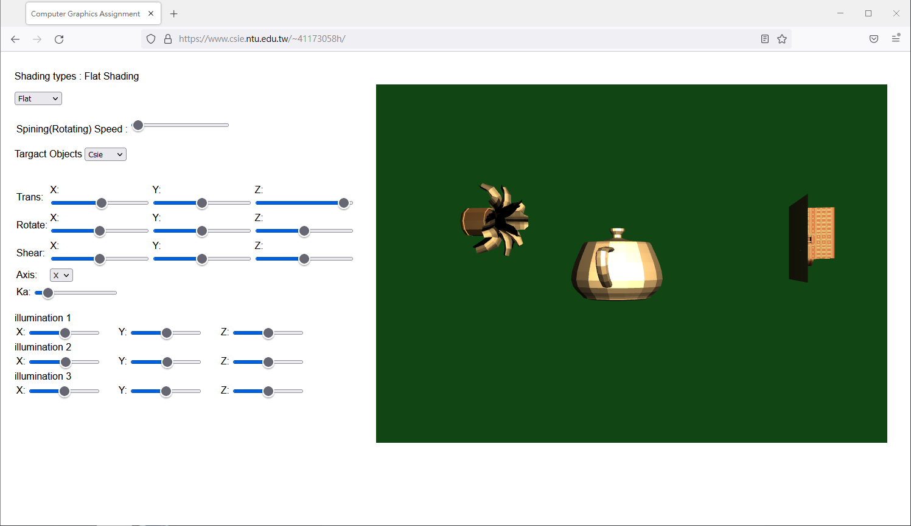

# ICG_2024_HW1

# NTU ICG HW1 (Multiple Shading and Transformation)
Homework 1 for Interactive Computer Graphics (2024 Spring), Dept. of Computer Science and Information Engineering, National Taiwan University.  
國立台灣大學資訊工程學系 計算機圖形（CSIE5085） ，歐陽明老師授課  

Implementation of the Flat shading, Gauraud shading, and Phong shading using WebGL.   

* 鍾詠傑
* 41173058h 
* NTNU CSIE/ME
* 二年級

## features
###  Requirements
In this homework, the following four requirements need to be fulfilled: shading, fundamental transforms, 3D clipping, multiple objects and lights.
### a. Shading
Implement Flat, Gouraud, and Phong shading in shaders. Note that for Gouraud
shading, TAs have already written part of the Gouraud shading in the sample code. You can either
complete the remaining parts to finish Gouraud shading or write your own.
Figure 1: Flat, Gouraud, and Phong shading.
### b. Fundamental Transforms
Enable four fundamental transforms (translate, rotate, scale and shear) on
objects in a scene. You are free to use those provided model files and arrange them to form the
scene on your own style.
### c. 3D Clipping
Implement 3D clipping, at least in one direction(x or y or z).
### d. Multiple Objects and Lights
The scene should include at least three lights and three objects. Among the types of
objects, there should be at least two objects from different models. Additionally, the scene must
include three lights at different positions. You can verify the presence of the three lights through
the specular highlights in Phong shading.
### Bonus
not finish in hw1
### upcomeing Features
* more animation
* 3 axis clipping
* change light color and direction in realtime
## reference
[https://webglfundamentals.org/webgl/lessons/zh_cn/](https://webglfundamentals.org/webgl/lessons/zh_cn/)
[https://learnopengl.com/](https://learnopengl.com/)
[https://www.csie.ntu.edu.tw/~ming/courses/icg/HW/DEMO2/](https://www.csie.ntu.edu.tw/~ming/courses/icg/HW/DEMO2/)
[https://www.csie.ntu.edu.tw/~ming/courses/icg/HW/DEMO3/](https://www.csie.ntu.edu.tw/~ming/courses/icg/HW/DEMO3/)

and the presentation slides in class

## discuss with
ChatGpt

ming (ref)

[ref](https://www.csie.ntu.edu.tw/~ming/courses/icg/HW/DEMO3/)

b10902112 (classmate)